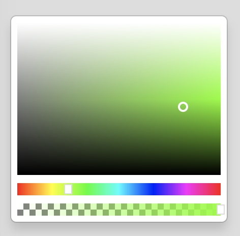

# Elm ColorPicker widget

An Elm library to help you implement a color picker tool without relying upon the presence - or [otherwise](http://caniuse.com/#feat=input-color) - of a built in browser widget.




## Example

```elm
import ColorPicker

type alias Model =
    { colorPicker : ColorPicker.State }


init : Model
init =
    { colorPicker = ColorPicker.init }

type Msg
    = CPMsg ColorPicker.Msg

update : Msg -> Model -> Model
update message model =
    case message of
        CPMsg msg ->
            let
                ( m, c ) =
                    ColorPicker.update msg model.colorPicker
            in
                { model | colorPicker = m }

view : Model -> Html Msg
view model =
    ColorPicker.view model.colorPicker |> Html.map CPMsg
```

See it in action

```sh
$ cd example
$ npm install
$ npm run dev
Open http://localhost:3000
```


### To Do

 * Enable use of different sizes of svg elements

### Changelog

 * 1.0.0 : Initial release


### Inspired by

 * https://github.com/bendc/color-picker
 * https://github.com/DavidDurman/FlexiColorPicker
 * https://stackoverflow.com/questions/17242144/javascript-convert-hsb-hsv-color-to-rgb-accurately?answertab=votes#tab-top
